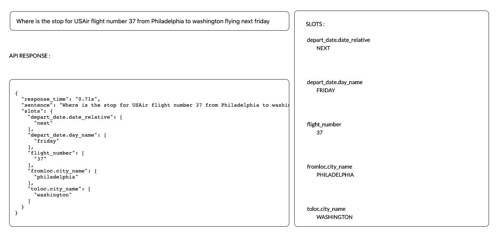

# 1. Using the model:

### Setup

Make sure you have python3.x and pip3 installed after that just run 

```
source build_env
```

This will create a virtual environemnt named `env` and also install the requirements!

### Configuration

Your model can be easily configured in the file `model_config.py` 

Ex:

```
class Config:
    EMBEDDING_SIZE = 100
    DROPOUT = 0.25
    N_EPOCHS = 20
    LOSS = crf_loss
    OPTIMIZER = 'rmsprop'
    MODEL = 'GRU_CRF'
    DATA_FILE = 'atis.pkl'
    PORT = '5004'
```

Before training your model, add the `DATA_FILE` key to your config which is your dataset file saved in the `/data` folder.  **Make sure you mention only file name NOT the path to the file.**

### Dataset Schema

| sentance_idx | word | tag  |
| ------------- |:-------------:| -----:|
| Sentance: 1    | philadelphia | B-fromloc.city_name | 
|    | to      |   O |
|  | san      |   B-toloc.city_name  |
|  | francisco      |   I-toloc.city_name  |

### Training & validation

```
python3 main.py --train
```

Validation is perfomed on every epoch, and based on the `F1-Score` the weights of the best model is saved in the `/trained_model` folder following the format - `trained_model_<N_EPOCHS>_<MODEL>_<F1_score>.h5`.

After training is done, the model with the best F1-Score is automatically kept in the `/trained_model` folder.

### Metrics

Validation script in the `/metrics` folder, we're using the already exsiting `conlleval.pl` pearl script for finding out the `Precision`, `Recall` and `F1-Score` after every epoch.

**:warning: NOTE :**

**The metrics works only for BIO tagged datasets.**

### Testing

You can directly test using the above command as the repo includes the `trained_model` as well :D

Go to `tests/text_sentances.txt` :

```
Where is the stop for USAir flight number thirty-seven from Philadelphia to San Francisco?

```

Make sure you add every sentance on one line and the run :

```
python3 main.py --test
```

Go to `tests/slots.txt` to find the output :

```
Where is the stop for USAir flight number 37 from Philadelphia to San Francisco

37 - B-flight_number
philadelphia - B-fromloc.city_name
san - B-toloc.city_name
francisco - I-toloc.city_name
----------------------------------------------------------------------------------------------------

```

**:warning: NOTE :**

**This project is still in development and the results might not be very accurate at the moment.**

### Logs

Once, the model is put into training, logs are generated and saved in `/logs` folder according to the format - `model_<N_EPOCHS>_<MODEL>.log` as mentioned in your configuration file. If you need different log outputs modify `/logs/logger.py`.

---

# 2. Using the API 
```
python3 app.py
```

Configure you app `PORT` in the configuration file, `model_config.py`

### Example :

Go to your browser use the above example sentance:

**SENTENCE:**\
`Where is the stop for USAir flight number 37 from Philadelphia to San Francisco flying next friday`

**API ENDPOINT:**

`/api/v1/slots?sentence=`

**EXAMPLE URL:**

```
GET http://localhost:9009/api/v1/slots?sentence=Where%20is%20the%20stop%20for%20USAir%20flight%20number%2037%20from%20Philadelphia%20to%20San%20Francisco%20flying%20next%20friday
```

**RESPONSE:**  (JSON format)

```
{
  "response_time": "0.79s", 
  "sentance": "Where is the stop for USAir flight number 37 from Philadelphia to San Francisco flying next friday", 
  "slots": {
    "depart_date.date_relative": [
      "next"
    ], 
    "depart_date.day_name": [
      "friday"
    ], 
    "flight_number": [
      "37"
    ], 
    "fromloc.city_name": [
      "philadelphia"
    ], 
    "toloc.city_name": [
      "san francisco"
    ]
  }
}
```

# 3. Demo App :

```
http://localhost:{PORT}/demo
```



**:warning: NOTE :**

**Make sure your don't change `tensorflow==1.13.1` and `keras==2.2.5` versions, the model breaks for a different combination, but you're free to test other versions! :stuck_out_tongue:**